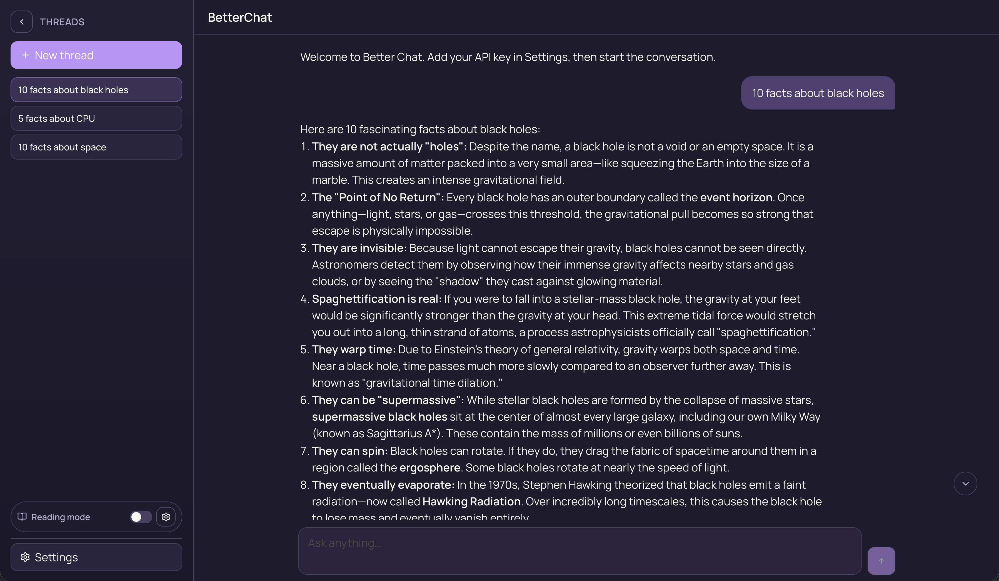
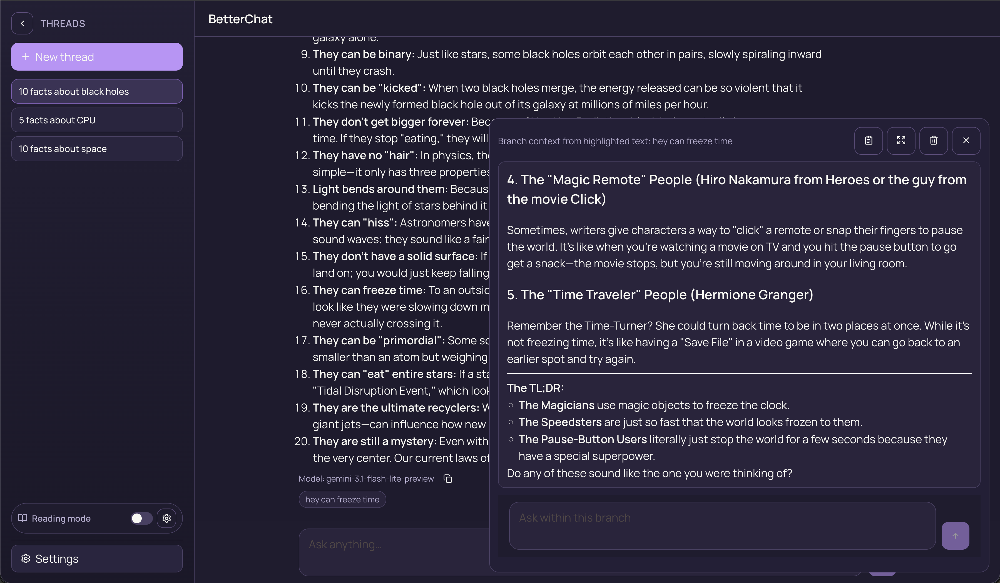
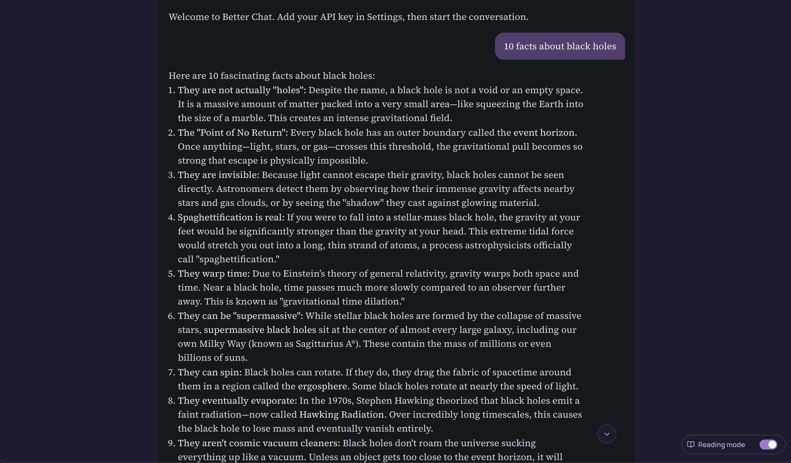

# Better Chat UI - [Web Interface](https://zedlabs.github.io/better-chat/)

Better Chat UI is a local-first, bring-your-own-key chat workspace for people who want more control than typical AI chat apps provide.

It is built for comparing providers, keeping conversations on your own machine, branching off interesting parts of a response, and switching into a cleaner reading view when long outputs need real attention.



## Quick Demo

See the product in action: [Watch the walkthrough video](./public/output.mp4)

## Why use it

Most chat apps are fine for quick prompts, but they start to break down when you need to:

- work across multiple providers without changing your workflow
- keep model and provider settings explicit instead of hidden
- branch from a specific part of a message without losing the main thread
- read long answers in a focused layout instead of a cramped chat pane
- store conversations locally instead of depending on a hosted backend

Better Chat UI is designed to make those workflows feel deliberate, fast, and predictable.

## What makes it useful

- BYOK support for OpenAI, Anthropic, and Gemini
- Provider-native streaming (SSE)
- Local chat persistence so your history stays on your machine
- Threaded workspace with persistence across reloads
- Selection-based branching with `+ Create New Branch Here`
- Global system prompt in Settings
- Smart Markdown rendering for structured answers
- Reading mode profiles that can hide the top bar, sidebar, composer, and user messages for distraction-free review
- Lightweight stack without a bloated framework layer

## See the main workflows

### Main workspace

Use the main chat UI for day-to-day prompting, provider switching, and longer working sessions.


### Branch from selected text

When a specific paragraph or idea deserves its own thread, highlight it and create a branch so you can explore that path without derailing the original conversation.



### Read long outputs comfortably

Reading mode reduces UI chrome so you can focus on the answer itself, which is especially useful for long explanations, drafts, reviews, and research notes.



## Why branching and reading mode matter

- **Branching keeps context precise.** A branch can be anchored to the exact text that triggered the follow-up, which makes exploration easier to trace.
- **Reading mode improves comprehension.** Long model outputs are easier to review when the surrounding UI gets out of the way.
- **The main thread stays clean.** You can test alternatives and side questions without turning one conversation into a mess.

## Local Development

```bash
npm install
npm run dev
```

Open the Vite URL, typically `http://localhost:5173`.

## Scripts

- `npm run dev` - start the local dev server
- `npm run test -- --run` - run tests once
- `npm run build` - type-check and create a production build
